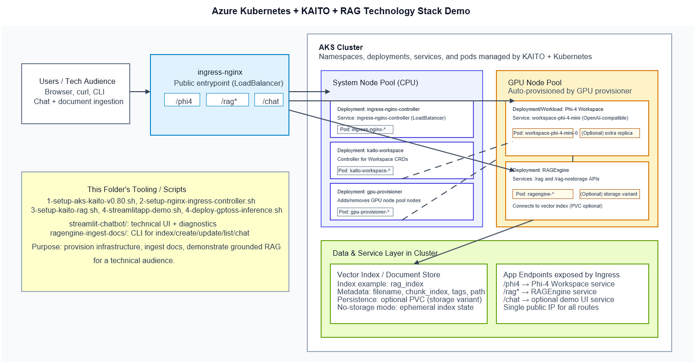

# AKS + KAITO + RAG Demo (aks-kaito)

This proejct folder contains an end-to-end demo for running **KAITO model workspaces** and **RAGEngine** on **Azure Kubernetes Service (AKS)**, exposed through **ingress-nginx**, with optional Streamlit/demo apps.

It is designed for technical demos and learning sessions.

References
- [KAITO Project](https://github.com/microsoft/kaito)
- [KAITO Documentation](https://microsoft.github.io/kaito/)
- [RAGEngine Documentation](https://microsoft.github.io/kaito/docs/reference/ragengine/)


## What this project deploys



- AKS cluster with OIDC/workload identity
- KAITO Workspace controller
- Azure GPU Provisioner (for GPU node auto-provisioning)
- Phi-4 workspace (`workspace-phi-4-mini`) for inference
- KAITO RAGEngine (`rag-nostorage` and/or storage variants)
- ingress-nginx with routes for:
  - `/phi4` (model inference)
  - `/rag` and `/rag-nostorage` (RAGEngine)
  - `/chat` (optional demo chat app)
- Optional Streamlit chatbot and ingestion tools under:
  - `streamlit-chatbot/`
  - `ragengine-ingest-docs/`

---

## Folder highlights

- `1-setup-aks-kaito-v0.80.sh` – Create AKS, install KAITO Workspace + GPU provisioner, deploy Phi-4 workspace
- `2-setup-nginx-ingress-controller.sh` – Install ingress-nginx and configure ingress routes
- `3-setup-kaito-rag.sh` – Install RAGEngine, optional PVC, and test indexing/querying
- `4-streamlitapp-demo.sh` – Deploy sample `kaitochatdemo` app
- `4-deploy-gptoss-inference.sh` – Deploy optional GPT-OSS workspace path
- `test-kaitochatdemo.sh` – Connectivity/debug checks for `/chat`
- `ingress-*.yaml` – Ingress rules
- `*-workspace*.yaml`, `bge-small-ragengine.yaml` – Workspace/RAGEngine manifests

---

## Prerequisites

- Azure subscription with permission to create AKS and managed identities
- Installed locally:
  - `az` (Azure CLI), `kubectl`, `helm`, `jq`, `curl`
- Logged in to Azure: `az login`

> Cost note: GPU-enabled AKS workloads can incur significant cost. Clean up resources after demos.

---

## Quick start (ordered execution)

Run from this folder:

```bash
cd ~/aks-demos/aks-kaito
```

### 1) Provision AKS + KAITO + GPU provisioner + Phi-4 workspace

Rather than running these bash scripts in one shot, I run each command manually one step at a time in a notebook style.

```bash
bash 1-setup-aks-kaito-v0.80.sh
```

What to verify:

```bash
kubectl get nodes -o wide
kubectl get workspace
kubectl get pods -n kaito-workspace
kubectl get pods -n gpu-provisioner
```

### 2) Install ingress-nginx and route traffic

```bash
bash 2-setup-nginx-ingress-controller.sh
```

What to verify:

```bash
kubectl get svc -n ingress-nginx -o wide
kubectl get ingress -A
```

Capture ingress public IP:

```bash
export INGRESS_IP=$(kubectl get svc ingress-nginx-controller -n ingress-nginx -o jsonpath='{.status.loadBalancer.ingress[0].ip}')
echo $INGRESS_IP
```

### 3) Install and test RAGEngine

Open up the following bash script and run each command manually to learn step by step.

```bash
bash 3-setup-kaito-rag.sh
```

The script includes index creation/listing and sample chat-completion tests through RAGEngine ingress endpoints.

---

## Core endpoint tests

### Test Phi-4 inference via ingress

```bash
curl -sS "http://$INGRESS_IP/phi4/v1/chat/completions" \
  -H "Content-Type: application/json" \
  -d '{
    "model": "phi-4-mini-instruct",
    "messages": [
      {"role": "system", "content": "You are a helpful assistant."},
      {"role": "user", "content": "Hello from AKS demo."}
    ],
    "temperature": 0.2,
    "max_tokens": 256
  }' | jq
```

### Test RAGEngine index list

```bash
curl -sS "http://$INGRESS_IP/rag-nostorage/indexes" | jq
```

### Test RAGEngine chat completion

```bash
curl -sS -X POST "http://$INGRESS_IP/rag-nostorage/v1/chat/completions" \
  -H "Content-Type: application/json" \
  -d '{
    "index_name": "rag_index",
    "model": "phi-4-mini-instruct",
    "messages": [
      {"role": "system", "content": "You are a knowledgeable assistant."},
      {"role": "user", "content": "What is RAG?"}
    ],
    "temperature": 0.2,
    "max_tokens": 2048,
    "context_token_ratio": 0.5
  }' | jq
```

---

## Optional demos

### Deploy sample chat UI

```bash
bash 4-streamlitapp-demo.sh
bash test-kaitochatdemo.sh
```

### Deploy optional GPT-OSS path

```bash
bash 4-deploy-gptoss-inference.sh
```

### Use advanced local tools

- `streamlit-chatbot/` for a richer RAG/LLM UI
- `ragengine-ingest-docs/` for ingestion/list/chat CLI workflows

---

## Common troubleshooting

### Workspace not ready

```bash
kubectl get workspace -A
kubectl describe workspace workspace-phi-4-mini -n default
kubectl logs -n default workspace-phi-4-mini-0 --all-containers --tail=200
```

### Ingress has no external IP

```bash
kubectl get svc ingress-nginx-controller -n ingress-nginx -o wide
kubectl get events -A --sort-by=.lastTimestamp | tail -n 50
```

### RAG returns no `source_nodes`

- Verify `index_name` exists and contains documents
- Prefer `max_tokens >= 2048` for this stack
- Validate endpoint path (`/rag-nostorage/v1/chat/completions` vs others)

---

## Cleanup (to avoid cloud costs)

If this demo used a dedicated resource group:

```bash
az group delete --name aks-solution --yes --no-wait
```

Also remove local kube context if needed:

```bash
kubectl config get-contexts
kubectl config delete-context rkaksdev || true
```

---

## Audience notes (for tech talks)

Good live demo sequence:

1. Show `kubectl get workspace` and ingress endpoints
2. Run `/phi4` completion request
3. Ingest sample docs into `rag_index`
4. Run RAG question and show `source_nodes`
5. Compare behavior with/without RAG retrieval evidence

This clearly demonstrates the difference between plain LLM generation and grounded RAG responses.
